# Frontend Mentor - Todo app solution

Esta es una solución al desafío de la [Todo App en Frontend Mentor](https://www.frontendmentor.io/challenges/todo-app-Su1_KokOW).

## Tabla de contenidos
  - [Screenshot](#screenshot)
    - [Tamaño Escritorio](#tamaño-escritorio)
    - [Tamaño Movil](#tamaño-movil)
  - [Funcionalidades](#funcionalidades)
  - [Links](#links)
  - [Herramientas y Tecnologias usadas](#herramientas-y-tecnologias)


## Screenshot
<br/>

### Tamaño Escritorio
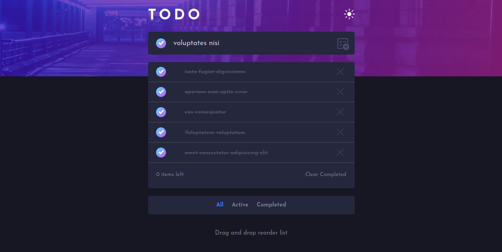
<br/>
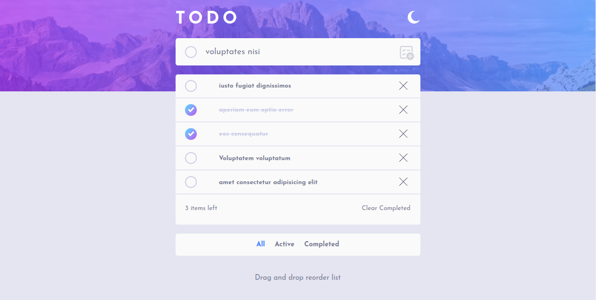
<br/>

### Tamaño Movil

<div style="display: flex;">
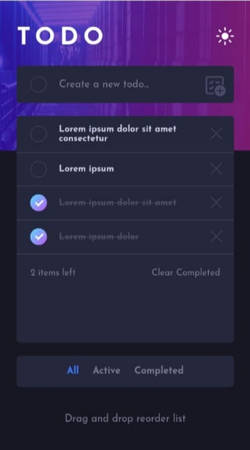
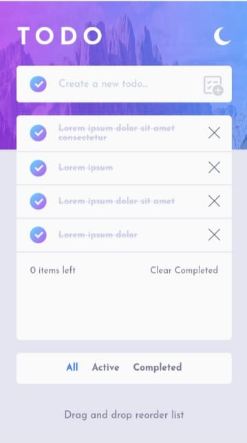
</div>


### Funcionalidades

- Ver el diseño óptimo para la aplicación según el tamaño de pantalla del dispositivo
- Agregar un nuevo Todo a la lista
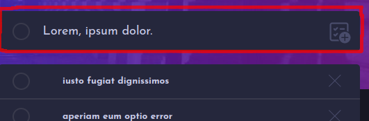
<hr/>

- Marcar un Todo como completo

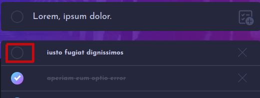
<hr/>

- Marcar todos los Todos como completos

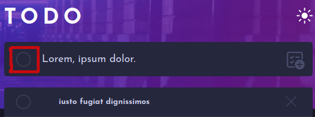
<hr/>

- Eliminar un Todo de la lista

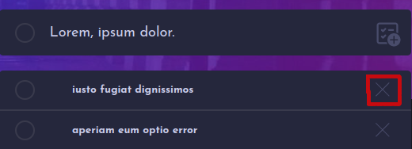
<hr/>

- Eliminar los Todos completos

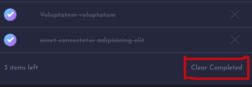
<hr/>

- Filtrar por: todos, activos y completos

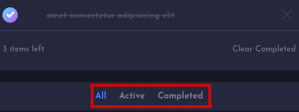
<hr/>

- Alternar modo claro y oscuro

<div style="display: flex;">

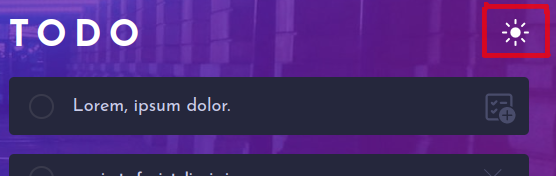
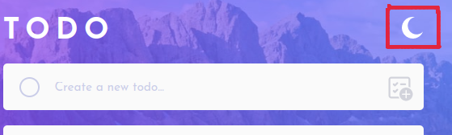

</div>

<hr/>

- Arrastrar y soltar elementos de la lista para reorganizarlos
- Mantener datos al recargar la pagina


### Links
- URL de la app: [https://todo-app-peach-one.vercel.app](https://todo-app-peach-one.vercel.app)

### Herramientas y Tecnologias usadas

- HTML5: Estructura de la Applicacion
- CSS3: EStilos de la Applicacion
- Javascript: Agregar funcionalidades
- [React](https://reactjs.org/): Libreria de Javascript
- [Vitejs](https://vitejs.dev/): Generador de plantillas de React
- [Redux Toolkit](https://redux-toolkit.js.org/): Manejador del estado de la Aplicacion
- [SortableJS](https://sortablejs.github.io/Sortable/): Funcionalidad de arrastrar y soltar
- Local Storage: Mantener datos al recargar la pagina
- Flujo de trabajo: Mobile-first

### Correr el proyecto en local
#### Requerimientos
- Tener [Git](https://git-scm.com) instalado
- Tener [Node.js](https://nodejs.org/en/download/) instalado

#### Instrucciones

1. Abrir una terminal en su sistema
2. Ejecutar el siguiente comando para clonar este repositorio:

```
git clone https://github.com/wilbernp/todo-app.git
```

3. Moverse a la raiz del proyecto

```
cd todo-app
```

4. Instalar las dependencias del proyecto

```
npm install
```

5. Iniciar el servidor del proyecto

```
npm run dev
```

6. Presionar CTRL + click en enlace [http://localhost:5173/](http://localhost:5173/) o similar que aparecera en la consola y con eso se abrira una pestaña en el navegador
